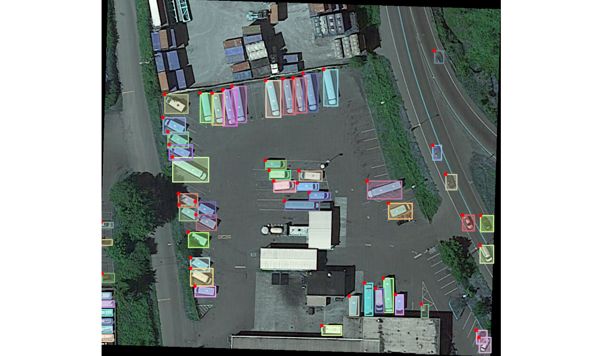
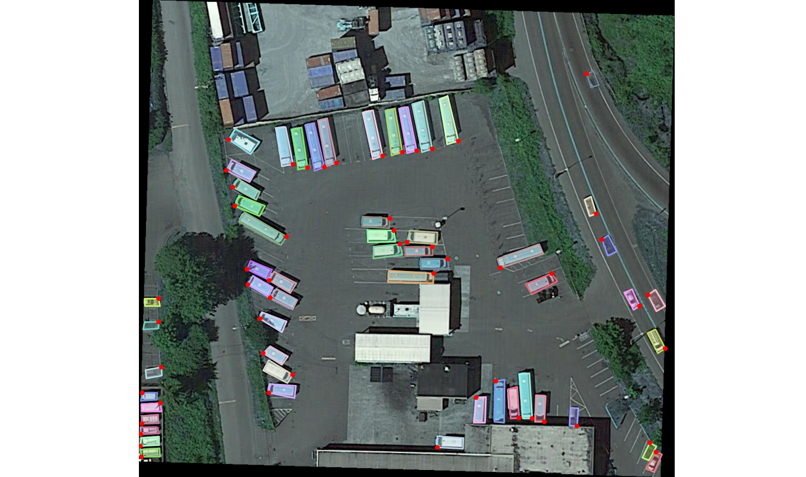
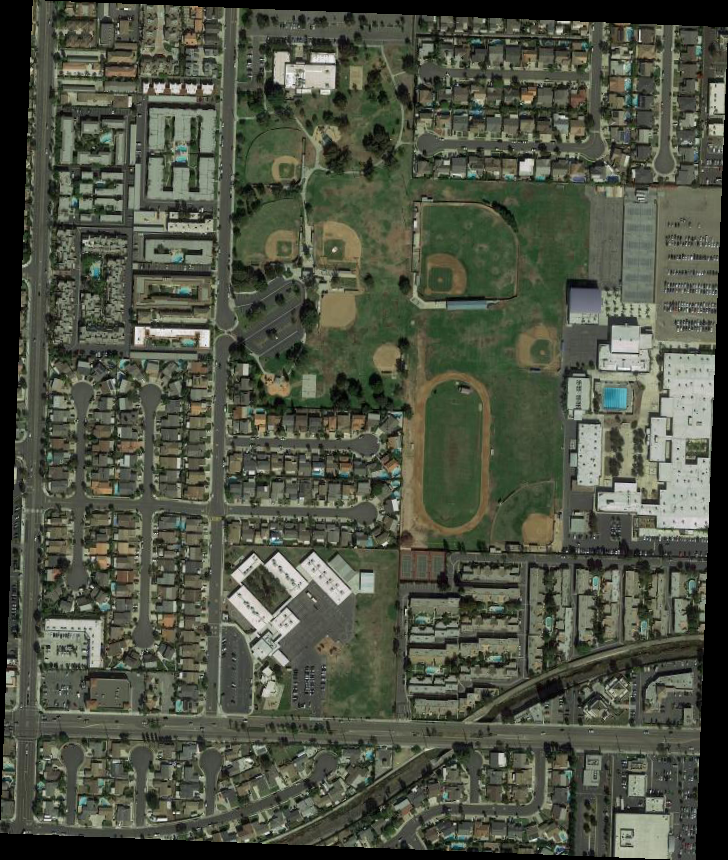
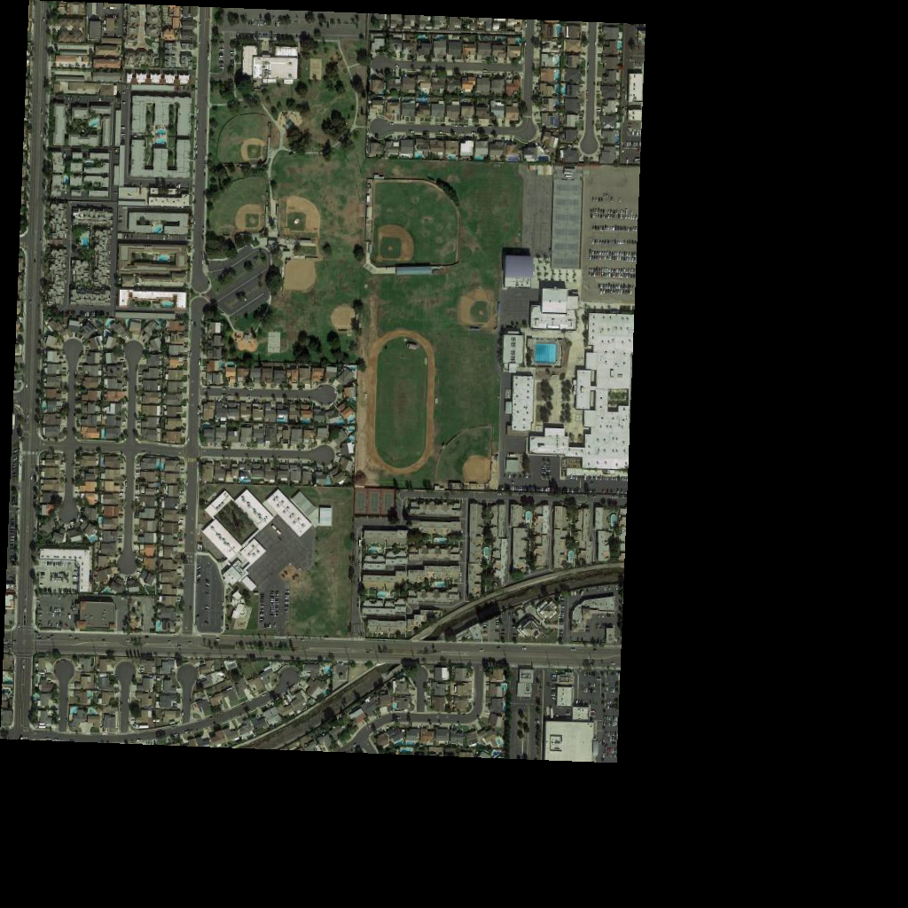
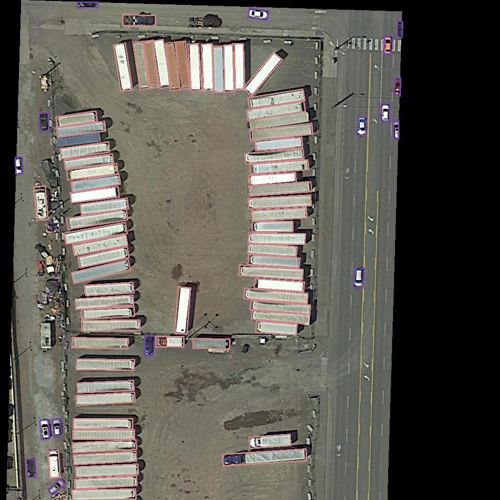
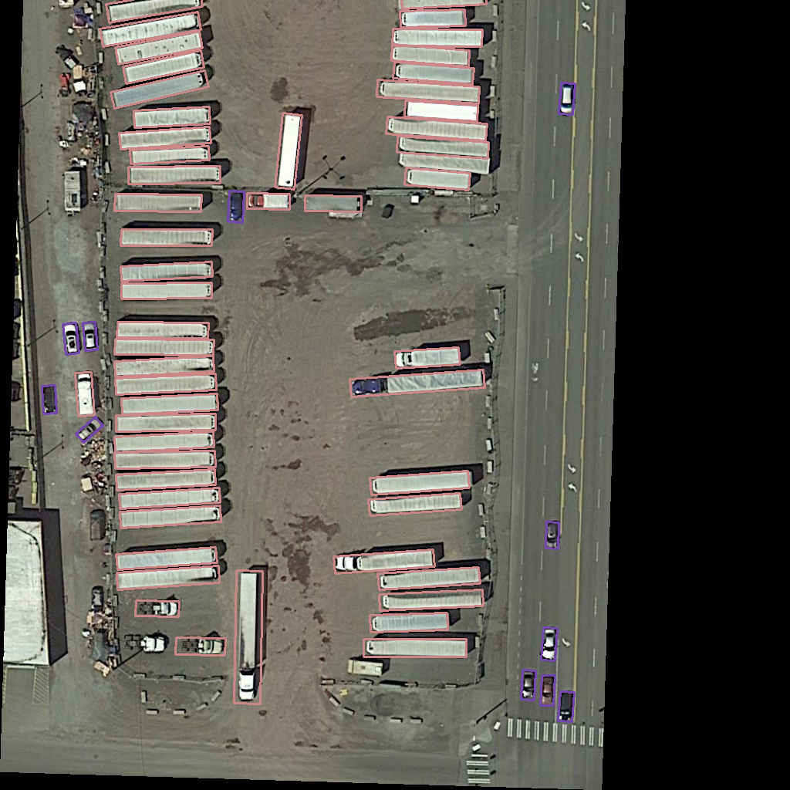
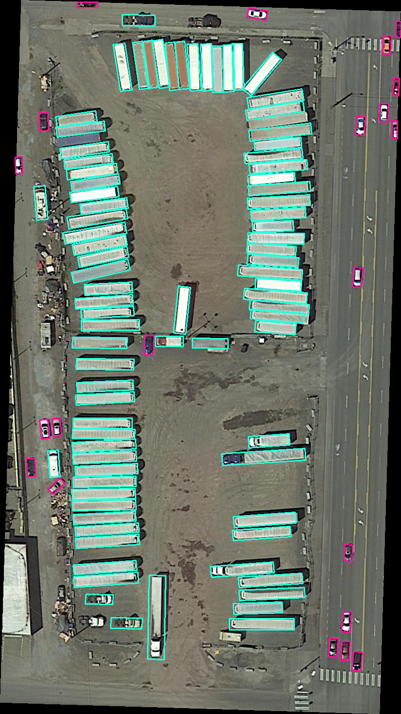
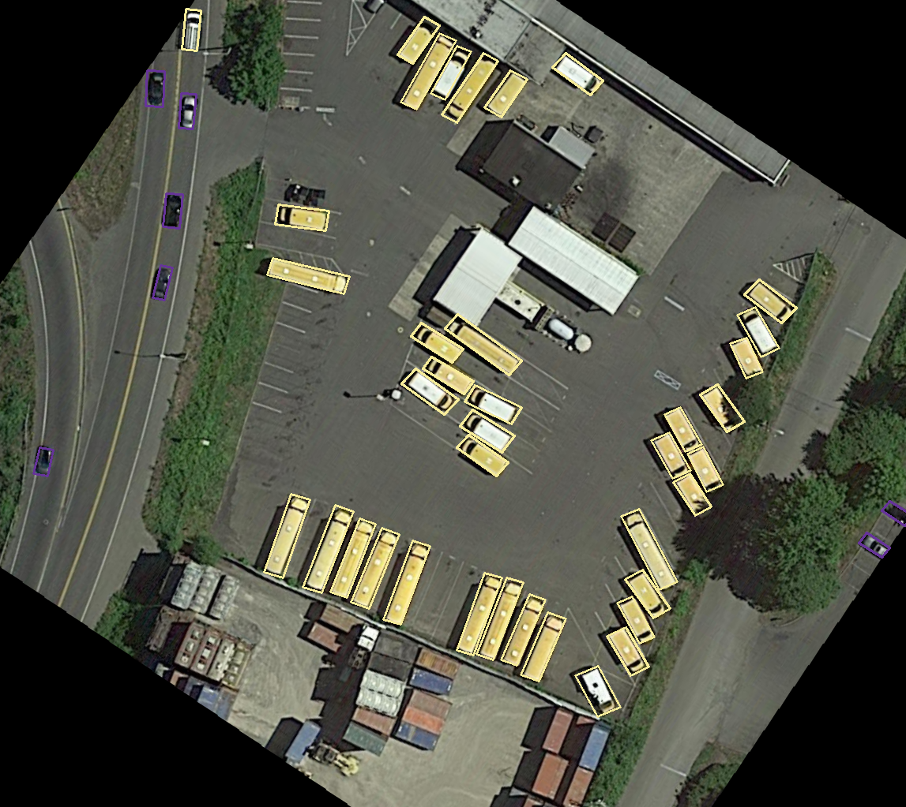

## Brief Introduction
Based on [DOTA_devkit](https://github.com/CAPTAIN-WHU/DOTA_devkit).  
Add some modules to trans DOTA annotation format to YOLO annotation format.  
Add some files for every demo.


## Fuction
* `DOTA.py`  Load image, and show the bounding oriented box.

* `ImgSplit.py` Split image and the label.

* `ResultMerge.py` Merge the detection result annotation txt.

* `dota_×_evaluation_task×.py` Evaluate the detection result annotation txt.

* `YOLO_Transformer.py`     Trans DOTA format to YOLO(OBB or HBB) format.

* `Draw_DOTA_YOLO.py` Picture the YOLO_OBB labels(after augmented).

## Installation
Same as [DOTA_devkit](https://github.com/CAPTAIN-WHU/DOTA_devkit).  Then:

```
$  pip install -r requirements.txt
```

## Usage Example
* `DOTA.py`     
```javascript
$  python DOTA.py
```


* `ImgSplit.py` 
```javascript
$  python ImgSplit_multi_process.py
```


* `ResultMerge.py` 
```javascript
$  python ResultMerge.py
```





* `dota_v1.5_evaluation_task1.py` 

change the path with yours.
```javascript
detpath = r'/.../evaluation_example/result_classname/Task1_{:s}.txt'
annopath = r'/.../evaluation_example/row_DOTA_labels/{:s}.txt'
imagesetfile = r'/.../evaluation_example/imgnamefile.txt'
```
```javascript
$  python dota_v1.5_evaluation_task1.py
```

* `YOLO_Transform.py` 
```javascript
$  python YOLO_Transform.py
```
```javascript
DOTA format:    poly classname diffcult
    To
YOLO HBB format: classid x_c y_c width height   ——   def dota2Darknet()
longside format： classid x_c y_c longside shortside Θ  Θ∈[0, 180)  ——  def dota2LongSideFormat()
```


* `Draw_DOTA_YOLO.py`

1.Run YOLO_Transformer.py to get the YOLO_OBB_labels first.

2.then augment YOLO_OBB_labels and visualize it:
```javascript
$  Draw_DOTA_YOLO.py
```

